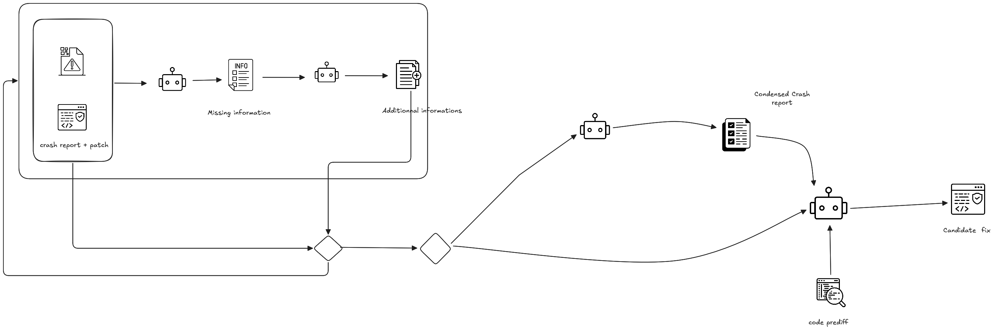
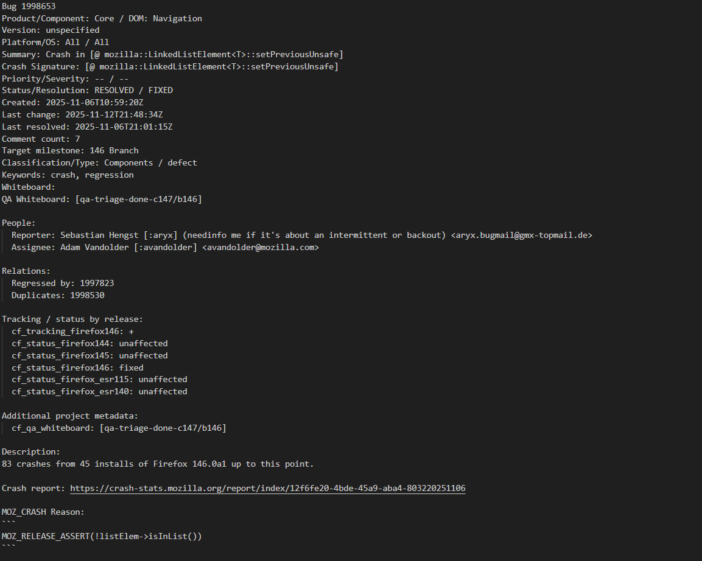
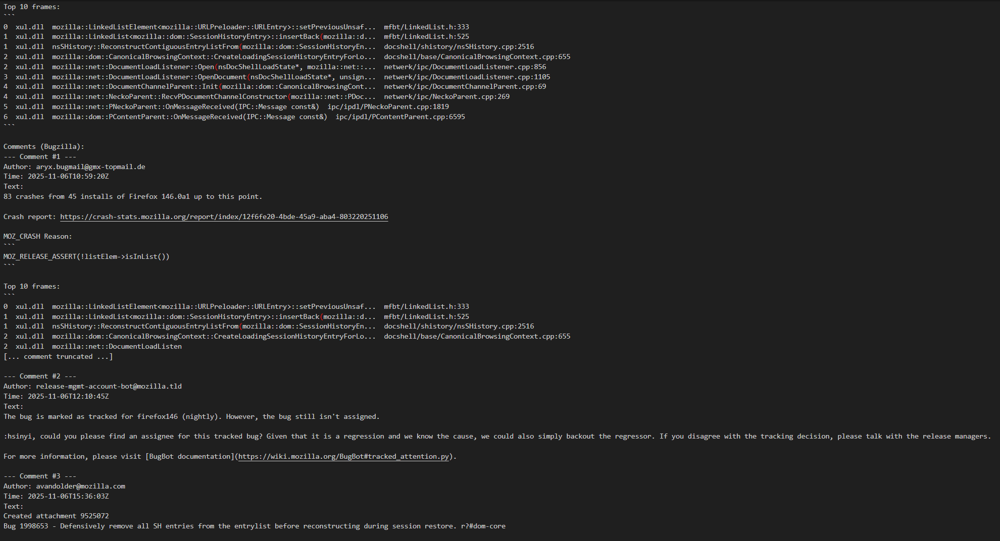
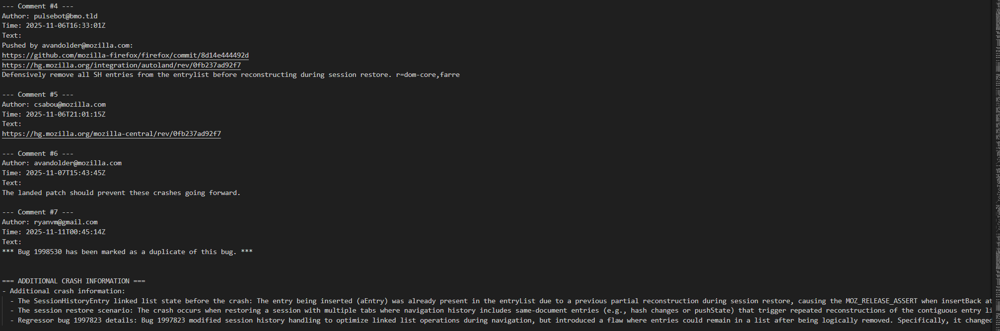
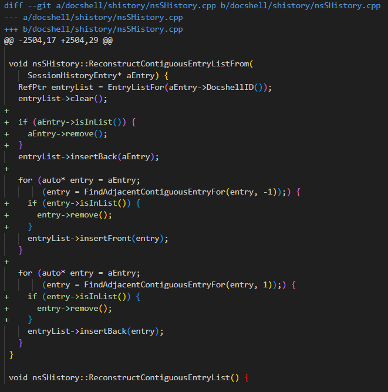
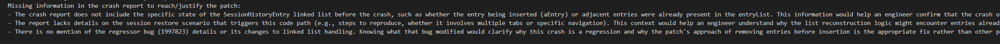
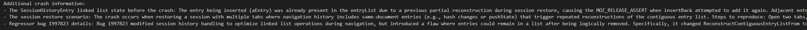
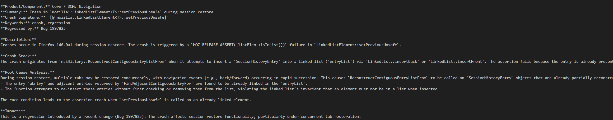
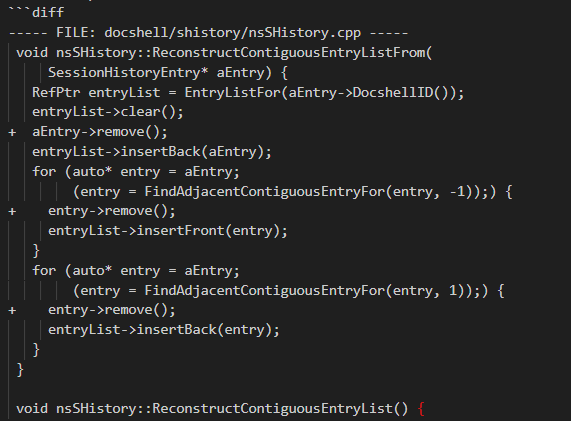
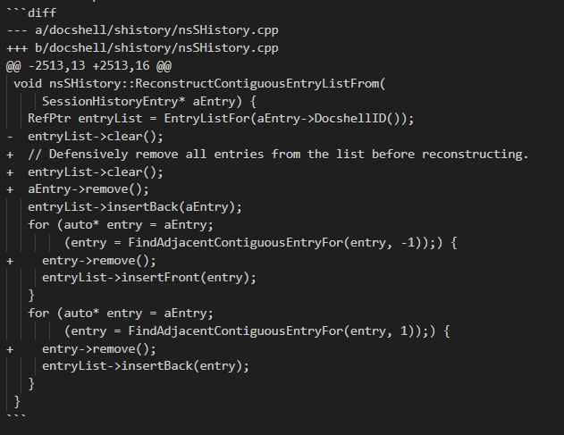

#  Crash context inference

These experiments explores how a language model can **infer missing crash-report context** and **synthesize patches** even when it has limited or no prior knowledge of specific entities (bugs, components, etc.).

## Goal

The end goal is to better understand:

- How language models reason about crashes,
- What *minimal* information they need,
- And how to structure crash reports so that the path to a patch is as clear and justifiable as possible.

---

## Crash Context Inference Pipeline

  

The pipeline takes as input:

- A real-world Firefox crash report (Bugzilla).
- A provided patch (Phabricator diff).

It then:

1. Infers **missing information** in the crash report needed to justify the patch.
2. Simulates **additional crash details** that would make the patch more obviously justified.
3. Produces a **condensed, patch-oriented crash report**.
4. Uses the crash report (full or condensed) plus original code to **generate a candidate patch**.

---

## Original Crash Report

  
  
  

The starting point is a real Bugzilla crash report, which may be noisy, incomplete, or missing key details that would clearly motivate the final patch.

---

## Provided Patch

  

We assume access to the **actual patch** that fixed the crash.  
The goal is to understand what information should have been present in the crash report to make this patch an obvious, well-justified fix.

---

## Step 1 – Missing Information

We first infer which **critical pieces of information are missing** from the original crash report, *given* the provided patch.

  

This step answers:

> “What isn’t stated in the crash report, but would help an engineer understand and confidently arrive at this specific patch as the fix?”

---

## Step 2 – Additional Crash Information

Next, we **simulate additional crash details** that fill in those missing pieces.

  

The model produces plausible, internally consistent information that:

- Complements the original crash report.
- Makes the path from crash to patch clearer.
- Stays focused on what is actually needed to justify the patch.

---

## Step 3 – Condensed Patch-Oriented Crash Report

After enriching the crash report, we **filter it down** to a minimal, patch-oriented version.

  

This condensed report:

- Keeps only the details that are essential to motivate this patch.
- Removes noise and unrelated information.
- Acts as a compact crash description that still explains *why* this patch makes sense.

---

## Step 4 – Candidate Patch Generation

Finally, we compare patch synthesis using:

- The **full crash report** vs.
- The **condensed crash report**,

combined with the original (pre-patch) code extracted from the diff.

  
   
  <em> Patch generated from the condensed crash report</em>
    

  
   
  <em> Patch generated using the full crash report</em>

This allows us to study:

- How much context a language model actually needs to propose a good patch.
- Whether a focused, patch-oriented crash report leads to **cleaner** or **more accurate** patch suggestions than the raw, noisy report.

---

## Technologies

- **Python** for orchestration and data processing.
- **Crewai** and **Deepseek** as the underlying language model backends.
- Bugzilla & Phabricator data as realistic crash and patch sources.

---

## Repository Structure (suggested)

- `images/` – Figures used in this README.
- `experiments/*.py` – Pipeline code for:
  - Fetching bugs and diffs.
  - Inferring missing information.
  - Simulating additional crash context.
  - Filtering crash reports.
  - Synthesizing candidate patches.
- `scripts/*.py` run the pipeline
---

